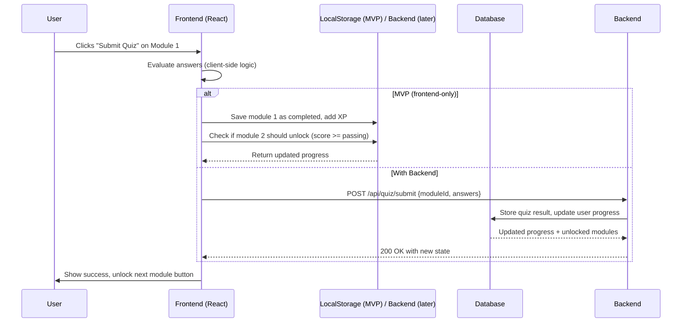

Below is a complete system design document for **StockMate**, based on your PDF draft and the frontend-focused PRD. It covers overview, requirements, core features, user flows, architecture, sequence diagrams, database schema, and tech stack. This will serve as a blueprint for building both frontend (first) and backend (later).

---

# StockMate – System Design Document

## 1. Overview

**StockMate** is an educational stock analysis web platform aimed at beginner investors (millennials, Gen Z, students). Unlike trading-focused apps, StockMate teaches users *why* a stock is worth buying through interactive simulations, visual analytics, and gamified learning modules.

**Key educational areas**:
- Fundamental analysis (ROE, ROA, DER, P/E, PBV, etc.)
- Technical analysis (candlesticks, support/resistance, trends)
- Market sentiment and news interpretation

The platform uses virtual money, stock filtering based on investor profile, and step-by-step learning modules with quizzes to build confidence before real investing.

## 2. Requirements

### Functional Requirements

| ID | Requirement |
|----|-------------|
| F1 | Users can register/login (email/password or social) |
| F2 | Users have a virtual balance (default Rp10M, can deposit more) |
| F3 | Dashboard shows IHSG index, market mood, top gainers/losers, daily insight, learning progress, streak, and quick action buttons |
| F4 | Users fill an investment profile (budget, horizon, risk, goal, sector) |
| F5 | System recommends stocks based on profile and displays match score, price, sector, trend, fundamental summary |
| F6 | Users can view detailed analysis of a stock: fundamental table, candlestick chart with support/resistance, AI insight, news, compare with another stock |
| F7 | Learning center contains modules with materials, practice exercises, quizzes, and summaries |
| F8 | Gamification: XP, levels, streak, module completion tracking |
| F9 | Quizzes must be passed to unlock next module |
| F10 | All user progress, virtual balance, and preferences are saved persistently (backend later) |

### Non-Functional Requirements

| ID | Requirement |
|----|-------------|
| N1 | Frontend responsive (mobile, tablet, desktop) |
| N2 | Charts load quickly, with mock data fallback if API is unavailable |
| N3 | UI is beginner-friendly (no jargon overload, tooltips, simple language) |
| N4 | LocalStorage can simulate backend for MVP (frontend-only demo) |
| N5 | Backend must be RESTful, stateless, with JWT authentication when implemented |

## 3. Core Features (Prioritized)

### MVP (Frontend-only with mock data)
1. **Dashboard** – virtual balance, market overview, progress, shortcuts.
2. **Investment Profile Filter** – 5-step questionnaire.
3. **Recommendation List** – mock stocks filtered client-side.
4. **Stock Analysis Page** – fundamental & technical (mock chart), AI insight, news, compare.
5. **Learning Center** – 3 modules with material, quiz, and unlock logic.
6. **Gamification** – XP, level, streak stored in `localStorage`.

### Post-MVP (Backend & real data)
1. User authentication & profiles.
2. Real-time stock data (IHSG, stock prices, financial ratios) via 3rd party API.
3. Buy/sell simulation with portfolio tracking.
4. Leaderboard (XP-based).
5. Admin panel to add modules/quizzes.

## 4. User Flow (Text-based)

```text
[Landing Page] 
     ↓
[Register/Login] (optional for MVP – skip for demo)
     ↓
[Beranda / Dashboard]
     ├──> [Mulai Analisis Saham] → [Filter Saham] 
     │                              ↓
     │                        [Hasil Filter Saham] (list rekomendasi)
     │                              ↓
     │                        [Klik Saham] → [Analisis Saham] (detail, chart, bandingkan)
     │
     └──> [Lanjutkan Belajar] → [Menu Belajar]
                                    ↓
                              [List Modul (terkunci/terbuka)]
                                    ↓
                              [Modul Detail] → (Materi → Praktik → Kuis)
                                    ↓
                              Jika kuis lulus → modul berikutnya terbuka, XP bertambah
```

## 5. Architecture (Frontend + Backend)

For now, **frontend-first** with mock data. Later you can attach a real backend.

### High-level architecture (future backend)

```
[Browser] (React SPA)
    │
    ├──> REST API (Node.js/Go/Python)
    │         │
    │         ├──> PostgreSQL (users, progress, stocks, modules)
    │         └──> Redis (cache for market data)
    │
    ├──> 3rd Party Stock API (e.g., Alpha Vantage, Yahoo Finance)
    │
    └──> LocalStorage (fallback / offline progress)
```

**Frontend-only MVP architecture**:

```
[React SPA]
    │
    ├──> Components (Dashboard, Filter, Recommendations, Analysis, Learning)
    ├──> State Management (Zustand / Context)
    ├──> localStorage (balance, progress, streak, preferences)
    └──> Mock JSON files (stocks, modules, market insights, chart data)
```

## 6. Sequence Diagram (Example: User takes a quiz and unlocks next module)



## 7. Database Schema (for future backend)

### Users table
```sql
CREATE TABLE users (
    id SERIAL PRIMARY KEY,
    email VARCHAR(255) UNIQUE NOT NULL,
    password_hash VARCHAR(255) NOT NULL,
    full_name VARCHAR(100),
    created_at TIMESTAMP DEFAULT NOW(),
    last_active DATE
);
```

### User Profiles (investment preferences)
```sql
CREATE TABLE user_profiles (
    user_id INT REFERENCES users(id) ON DELETE CASCADE,
    virtual_balance DECIMAL(12,2) DEFAULT 10000000,
    risk_tolerance VARCHAR(20), -- low, medium, high
    investment_horizon VARCHAR(20), -- short, medium, long
    investment_goal VARCHAR(30), -- capital_gain, dividend, both
    preferred_sectors TEXT[], -- array of sectors
    updated_at TIMESTAMP
);
```

### Stocks (master data)
```sql
CREATE TABLE stocks (
    ticker VARCHAR(10) PRIMARY KEY,
    name VARCHAR(100),
    sector VARCHAR(50),
    current_price DECIMAL(12,2),
    roe DECIMAL(5,2),
    roa DECIMAL(5,2),
    npm DECIMAL(5,2),
    der DECIMAL(5,2),
    pe_ratio DECIMAL(10,2),
    pbv DECIMAL(10,2),
    net_profit DECIMAL(15,2),
    total_revenue DECIMAL(15,2),
    updated_at DATE
);
```

### Learning Modules
```sql
CREATE TABLE modules (
    id SERIAL PRIMARY KEY,
    title VARCHAR(100),
    description TEXT,
    xp_reward INT DEFAULT 50,
    order_number INT,
    required_module_id INT NULL REFERENCES modules(id)
);
```

### Quizzes
```sql
CREATE TABLE quizzes (
    id SERIAL PRIMARY KEY,
    module_id INT REFERENCES modules(id),
    question TEXT,
    options JSONB, -- ["option A", "option B", ...]
    correct_answer INT -- index of correct option (0-based)
);
```

### User Progress
```sql
CREATE TABLE user_progress (
    user_id INT REFERENCES users(id),
    module_id INT REFERENCES modules(id),
    completed BOOLEAN DEFAULT FALSE,
    quiz_score INT, -- percentage
    completed_at TIMESTAMP,
    PRIMARY KEY (user_id, module_id)
);
```

### User Learning Stats
```sql
CREATE TABLE user_learning_stats (
    user_id INT PRIMARY KEY REFERENCES users(id),
    total_xp INT DEFAULT 0,
    level INT DEFAULT 1,
    streak_days INT DEFAULT 0,
    last_activity_date DATE
);
```

## 8. Tech Stack (Recommended)

### Frontend (build first)
| Category | Choice |
|----------|--------|
| Framework | React + Vite |
| Language | TypeScript (optional but recommended) |
| Styling | Tailwind CSS + daisyUI / shadcn/ui |
| Charting | Lightweight Charts (TradingView) or Recharts |
| State | Zustand (lightweight) |
| Routing | React Router v6 |
| Mock data | JSON files in `/src/mocks` |
| Storage (MVP) | `localStorage` for user progress, balance |

### Backend (future)
| Category | Choice |
|----------|--------|
| API | Node.js + Express (or Go Fiber if performance needed) |
| Auth | JWT + bcrypt |
| Database | PostgreSQL |
| ORM | Prisma (easiest with TypeScript) |
| Cache | Redis (for IHSG, top gainers) |
| Stock API | Alpha Vantage (free tier) or Yahoo Finance (unofficial) |